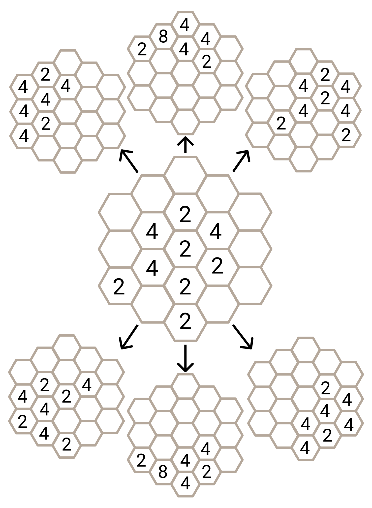
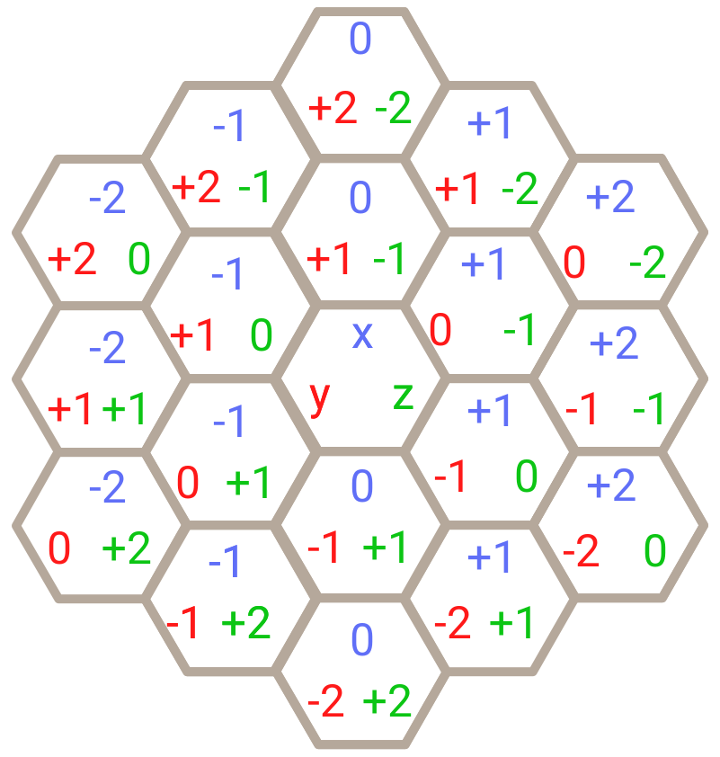

# Hexagonal 2048

## Task description

Your task is to develop game [2048](https://play2048.co/) on hexagonal field.
Please take a look our example: [hexagonal 2048](http://hex2048.surge.sh/).

What is required:

- Have to render a game hexagonal field with hexagons according to the game
  size.
- Required game size is 2. Existence of other game levels (3, 4, ...) is highly
  appreciated but NOT REQUIRED.
- Have to receive data from the
  [server](#receiving-data-from-the-deployed-server) and render them correctly.
- Have to handle appropriate keyboard keys according to the
  [rules](#directions-and-keys).
- Have to change field data by clicking keyboard keys according to the
  [rules](#shifting-rules).
- Have to work on the latest Google Chrome on the desktop (all other devices and
  browsers are up to you).
- All other ideas, game features and controls, supported devices and so on are
  optional.

Nice to have:

- Several game levels (at least 3 and 4) ([example](http://hex2048.surge.sh/)).

More info:

- **Useful article about hexagons:
  [Hexagonal Grids](https://www.redblobgames.com/grids/hexagons/)**.
- The visual game appearance and technologies to implement the task are up to
  you and are restricted only your imagination.
- Animations are appreciated but not required.

## Rules

### Directions and Keys

You have 6 keyboard keys (latin lower case letters) for 6 existing directions:

| Direction                 | Keyboard key |
| ------------------------- | :----------: |
| north (top)               |      W       |
| north-east (top-right)    |      E       |
| north-west (top-left)     |      Q       |
| south (bottom)            |      S       |
| south-east (bottom-right) |      D       |
| south-west (bottom-left)  |      A       |

After pressing any of the listed keys, all your numbers should be shifted in the
chosen direction.

### Shifting rules

Shifting works according to common [2048](https://play2048.co/) rules
([RU](<https://ru.wikipedia.org/wiki/2048_(%D0%B8%D0%B3%D1%80%D0%B0)>) |
[EN](<https://en.wikipedia.org/wiki/2048_(video_game)>)) taking into account
appropriate hexagonal direction.

| before shift → |   after |
| -------------: | ------: |
|            2 2 |       4 |
|          2 2 2 |     2 4 |
|        2 4 2 4 | 2 4 2 4 |
|        2 2 4 4 |     4 8 |



After each shift, you need to place new numbers received from the
[server](#rng-server).

### Game status

The game should know a current game status.

Possible game statuses:

- `playing` - there are possible moves that can be done.
- `game-over` - there are no more possible moves.

Game status should be present somewhere in your game DOM element (any one DOM
element at the any place of DOM) as a data attribute `data-status`. Example:

```html
<div>Game Status: <span data-status="playing">playing</span></div>
```

## RNG Server

## Receiving data from the deployed server

For the game purposes, we have a
[random number generator](https://en.wikipedia.org/wiki/Random_number_generation)
(RNG) server that generates random numbers into random places for your field.

The server expects you to send a POST request with correct body and pathname in
the URL. Body has to be an array of non-empty cells (the number should be 2 and
more) of your field. Cells order doesn't matter. A cell is an object which is a
representation of
[cube coordinates](https://www.redblobgames.com/grids/hexagons/#coordinates-cube).
For example:

```js
const cell = {
  x: 0,
  y: 1,
  z: -1,
  value: 2,
}
```

The server responds with array of the
[cube coordinates](https://www.redblobgames.com/grids/hexagons/#coordinates-cube)
cells that you need to add into your field. The servers sends an empty array in
case of no more positions to add a new numbers. `x`, `y`, `z` are positions for
new numbers. `value` is a number to add at that position.



The server expects you to send the radius (game level) in the URL pathname
(e.g., `/2` for 2, `/3` for 3, etc.). For example, correct server URL for game
radius 2 is `http://51.15.207.127:13337/2`.

Server URL: `51.15.207.127` or
`be348fb6-960c-4f9a-9bdc-f38a83f20f18.pub.instances.scw.cloud`.

Server port: `13337`.

Example (initial game):

```bash
curl -d '[]' \
     -X POST http://51.15.207.127:13337/2
```

Server response:

```
[
  { "x": 0, "y": 1, "z": -1, "value": 2},
  { "x": 1, "y": 0, "z": -1, "value": 2},
  { "x": 1, "y": -1, "z":  0, "value": 2}
]
```

Example with payload (filled cells):

```bash
curl -d '[{"x": 0, "y": 0, "z": 0, "value": 2}]' \
     -X POST http://51.15.207.127:13337/2
```

Server response:

```
[ { "x": 1, "y": -1, "z": 0, "value": 2 } ]
```

### Receiving data from the local server

To start the server locally you should clone the repository, install
dependencies and start the server:

```
git clone https://github.com/evolution-gaming/typescript-bootcamp.git
cd typescript-bootcamp/assigment/hex2048
npm install
npm run rng-server
```

Server URL: `http://localhost`.

Server port: `13337`.

Example:

```bash
curl -d '[{"x": 0, "y": 0, "z": 0, "value": 2}]' \
     -X POST http://localhost:13337/2
```

Server response:

```
[ { "x": 1, "y": -1, "z": 0, "value": 2 } ]
```

## How will your solution be tested?

Every cell from the field should have appropriate data attributes: `data-x`,
`data-y`, `data-z` and `data-value`. Where `data-x`, `data-y`, `data-z` are
respective representations of cube coordinates `x`, `y`, `z`. And `data-value`
is number into this cell (e.g., 2, 4, 8, etc. or 0 if there is no number yet).

Example:

```html
<div data-x="1" data-y="-1" data-z="0" data-value="8">8</div>
<div data-x="1" data-y="-1" data-z="0" data-value="0"></div>
```

Do not forget to add `gate-status` attribute. [Read more](#game-status)

Your game should recognize hash in the URL (to run a correct game level for
tests):

- `/#test2` - where your application will start the game with radius 2
- `/#test3` - with radius 3
- `/#test4` - with radius 4

Example:

- http://hex2048.surge.sh/ - a game link
- http://hex2048.surge.sh/#test2 - the link that automatically starts a game
  with radius 2
- http://hex2048.surge.sh/#test3 - the link that automatically starts a game
  with radius 3

**Do not forget to refer to our [example](http://hex2048.surge.sh/) to check how
elements should be marked in DOM.**

### Run tests locally

To run tests locally you should clone the repository, install dependencies and
run tests:

```
git clone https://github.com/evolution-gaming/typescript-bootcamp.git
cd typescript-bootcamp/assigment/hex2048
npm install
npm run test-game
```

By default, the server connects to `http://localhost:8080` but you can change
this behavior by passing `url` parameter. Example:

```
npm run test-game -- --url=http://localhost:3000
```

or

```
npm run test-game -- --url=http://hex2048.surge.sh
```

## Grading Notes

For extra credits, you should the following (one or more):

- Support radiuses more than 2 (at least 3, 4 and even more)
- Cover your code base with unit tests (with a common sense of course)
- Implement animations
- Put your realization on the Internet (free resources:
  [surge](http://surge.sh), [netlify](http://netlify.com),
  [vercel](https://vercel.com))

## Task submission

Please publish the solution in a private [GitHub](https://github.com/)
repository and give user [@evo-home-task](https://github.com/evo-home-task)
access to the repository.
